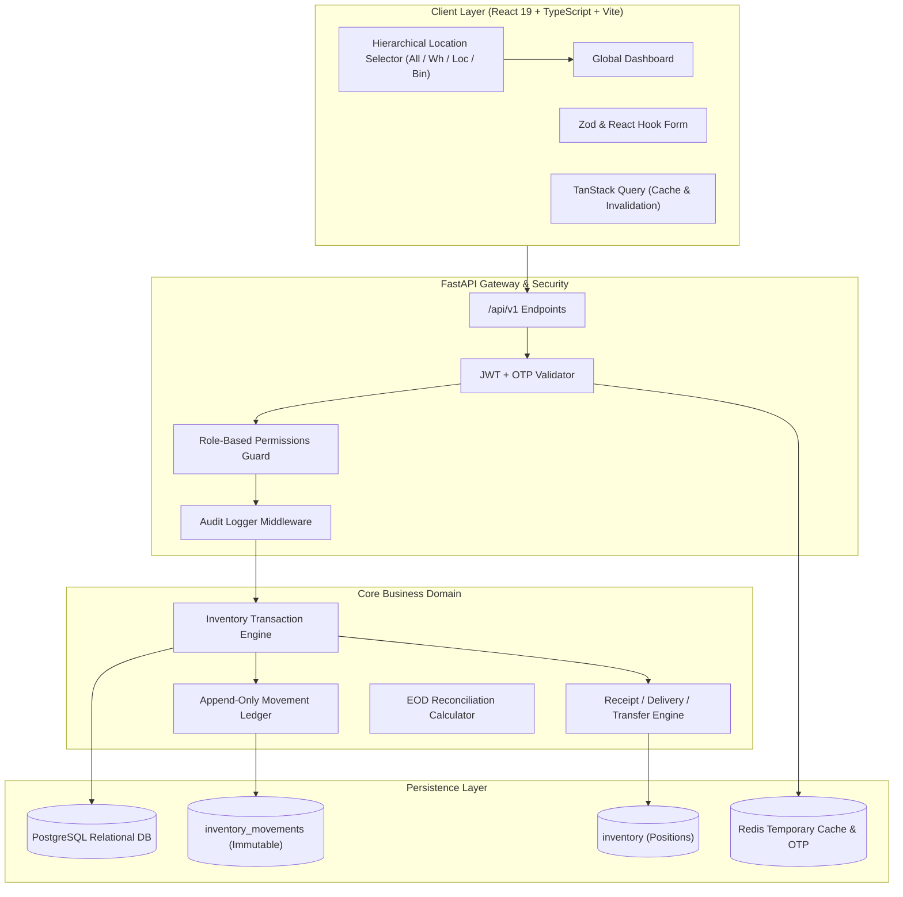
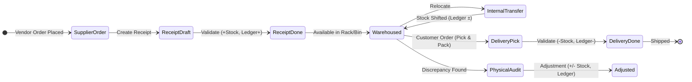
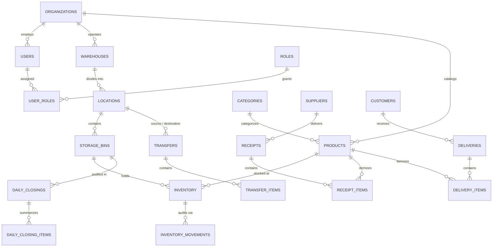

<div align="center">

# 📦 STOCKSENSE
### Next-Generation Centralized Multi-Location Inventory Management System

[](https://github.com/abidshareef/StockSense/stargazers)
[](https://github.com/abidshareef/StockSense/network/members)
[](https://github.com/abidshareef/StockSense/issues)
[](LICENSE)

<br/>

[](https://fastapi.tiangolo.com)
[](https://python.org)
[](https://postgresql.org)
[](https://react.dev)
[](https://typescriptlang.org)
[](https://tailwindcss.com)
[](https://docker.com)
[](https://redis.io)

<p align="center">
  <b>Replaces manual registers, scattered spreadsheets, and fragmented logistics with an audit-ready, real-time, ledger-backed ERP.</b>
</p>

[Key Features](#-key-features) • [System Architecture](#-system-architecture) • [Inventory Flow](#-inventory-flow) • [Quick Start](#-quick-start) • [Demo Credentials](#-demo-credentials) • [API Specification](#-api-specification) • [Reconciliation Engine](#-end-of-day-reconciliation-math)

---

</div>

## 🌟 Key Features

| Capability | Enterprise Implementation |
| :--- | :--- |
| **Hierarchical Location Engine** | One central dashboard cascading into Warehouses &rarr; Sub-locations (Floor/Zone) &rarr; Racks & Bins. Filter any view across the entire enterprise in real time. |
| **Double-Entry Stock Ledger** | Immutable, append-only transaction ledger (`inventory_movements`) logging every unit change with `quantity_before`, `quantity_change`, and `quantity_after`. |
| **Atomic Inventory Operations** | Safe transactions with row-level locks (`SELECT FOR UPDATE`) guaranteeing that stock cannot silently become negative. |
| **Receipts (Incoming Stock)** | Complete procurement pipeline from vendor order to receipt validation: `DRAFT` &rarr; `WAITING` &rarr; `READY` &rarr; `DONE`. |
| **Delivery Orders (Outgoing)** | Full dispatch lifecycle with availability verification, picking, packing, and atomic stock decrements. |
| **Internal Bin Transfers** | Relocate inventory between warehouses or bins without changing aggregate company stock, generating dual ledger entries. |
| **Stock Adjustments** | Reconcile physical inventory discrepancies (Damage, Loss, Found, Count Corrections) with compulsory audit reasons. |
| **End-of-Day (EOD) Reconciliation** | Mathematical balancing engine: `Opening + Receipts - Deliveries + Transfers In - Transfers Out ± Adjustments = Expected`. |
| **Cryptographic 2FA & OTP** | Hashed short-lived OTP verification for both registration and login, with attempt throttling and cooldown protection. |
| **Role-Based Access Control** | Strictly partitioned permissions across `ADMIN`, `INVENTORY_MANAGER`, and `WAREHOUSE_STAFF`. |
| **Real-Time Analytics & KPIs** | Live inventory valuation, stock turnover velocity, days of stock, dead stock detection, and top-moving SKU analytics. |

---

## 🏗 System Architecture

StockSense adheres to a strict single-source-of-truth model. Frontend clients never compute inventory balances—all calculations and state transitions are strictly governed by backend database transactions.



---

## 🔄 Core Operational Lifecycles

### 1. Unified Inventory State Machine



---

## 📊 Database Schema (Normalized Relational ERD)



---

## 🚀 Quick Start

### Option A: One-Command Docker Deployment (Recommended)

Make sure Docker is running on your system, then launch the complete stack (PostgreSQL + Redis + FastAPI Backend + React Frontend):

```bash
# Clone the repository
git clone https://github.com/abidshareef/StockSense.git
cd StockSense

# Copy sample environment configuration
cp .env.example .env

# Spin up all containers
docker compose up --build
```

- **Frontend App**: `http://localhost:5173`
- **FastAPI OpenAPI Swagger**: `http://localhost:8000/docs`
- **PostgreSQL Database**: `localhost:5432` (`stocksense_db`)
- **Redis Cache**: `localhost:6379`

---

### Option B: Local Dual-Process Development

<details>
<summary><b>Click to expand step-by-step local setup (Windows / macOS / Linux)</b></summary>

#### 1. Backend Setup (FastAPI & Python 3.11+)

```bash
cd backend

# Create & activate a virtual environment
python -m venv venv
# On Windows:
venv\Scripts\activate
# On Linux/macOS:
source venv/bin/activate

# Install requirements
pip install -r requirements.txt

# Start backend server
uvicorn app.main:app --reload --port 8000
```

#### 2. Frontend Setup (React 19, TypeScript & Vite)

```bash
cd frontend

# Install node dependencies
npm install

# Start Vite dev server
npm run dev
```

The frontend will run at `http://localhost:5173` and automatically proxy API calls to `http://localhost:8000`.

</details>

---

## 👥 Demo Credentials

The database comes pre-seeded with sample enterprise environments, multi-warehouse structures, and role-based test users:

| Role | Email | Password | Allowed Capabilities |
| :--- | :--- | :--- | :--- |
| **System Admin** | `admin@stocksense.local` | `AdminPass@123` | Full access, user management, warehouse configuration, audits |
| **Inventory Manager** | `manager@stocksense.local` | `ManagerPass@123` | Operations, receipts, deliveries, transfers, adjustments, reports |
| **Warehouse Staff** | `staff@stocksense.local` | `StaffPass@123` | Assigned location views, picking, packing, stock counts |

> 💡 **Development Note:** In development mode (`DEV_MODE=true`), all OTP verification codes are printed directly to the backend terminal for instant access.

---

## 📐 End-of-Day Reconciliation Math

StockSense guarantees physical-to-digital inventory integrity with its transparent End-of-Day (EOD) calculation engine:

$$\mathbf{Closing_{Expected}} = \mathbf{Stock_{Open}} + \sum \mathbf{Receipts} - \sum \mathbf{Deliveries} + \sum \mathbf{Transfers_{In}} - \sum \mathbf{Transfers_{Out}} \pm \sum \mathbf{Adjustments}$$

$$\mathbf{Variance} = \mathbf{Closing_{Physical}} - \mathbf{Closing_{Expected}}$$

- **Zero Variance ($\mathbf{0}$):** The location's inventory is balanced and ready for automated closing.
- **Negative Variance ($-\Delta$):** Unaccounted stock shrinkage or damage; requires user justification and creates an automatic adjustment record.
- **Positive Variance ($+\Delta$):** Found or unaccounted incoming units; creates logged audit entries for reconciliation.

---

## 📡 API Specification Overview

The backend automatically generates interactive OpenAPI documentation at `/docs`.

<details>
<summary><b>Click to view core API endpoints</b></summary>

### 🔐 Authentication & Session
- `POST /api/v1/auth/register` — Register user & issue signup OTP
- `POST /api/v1/auth/verify-otp` — Verify OTP & activate account
- `POST /api/v1/auth/login` — Check password & send 2FA OTP
- `POST /api/v1/auth/login/verify-otp` — Verify login OTP & issue JWT access + refresh tokens
- `POST /api/v1/auth/refresh` — Refresh access token
- `GET /api/v1/auth/me` — Current authenticated user profile & permissions

### 🏢 Warehouses & Locations
- `GET /api/v1/locations/warehouses` — List all warehouses
- `GET /api/v1/locations/tree` — Complete multi-level hierarchy (Warehouse &rarr; Location &rarr; Bin)
- `POST /api/v1/locations/warehouses` — Create a warehouse
- `POST /api/v1/locations/bins` — Create a storage bin

### 📦 Products & Catalog
- `GET /api/v1/products` — Paginated product catalog with category & search filters
- `POST /api/v1/products` — Create new product with unique SKU & reorder thresholds
- `GET /api/v1/products/{id}` — Product profile with real-time location breakdown

### 📊 Inventory & Ledger
- `GET /api/v1/inventory/stock` — Filtered stock positions across Warehouses/Locations/Bins
- `GET /api/v1/inventory/ledger` — Immutable move history audit trail
- `GET /api/v1/inventory/alerts/low-stock` — Products below reorder thresholds

### ⚡ Operations
- `GET /api/v1/operations/receipts` — List vendor receipts
- `POST /api/v1/operations/receipts/{id}/validate` — Atomic receipt validation (`+Stock`)
- `POST /api/v1/operations/deliveries/{id}/validate` — Delivery order validation (`-Stock`)
- `POST /api/v1/operations/transfers/{id}/complete` — Internal transfer (`Source -`, `Dest +`)
- `POST /api/v1/operations/adjustments` — Physical count discrepancy reconciliation

### 📈 Reports & Analytics
- `GET /api/v1/analytics/dashboard/kpis` — Real-time high-level KPIs
- `GET /api/v1/analytics/sales` — Stock turnover, velocity, and top-selling SKUs
- `GET /api/v1/reports/stock-valuation` — Stock valuation report with CSV export

</details>

---

## 🛡️ Critical Inventory Invariants

1. **Non-Negative Invariant**: `quantity_on_hand` cannot silently drop below zero. Enforced via database constraints and pessimistic row locks.
2. **Double-Entry Accuracy**: Every unit moved out of a source location must be coupled with an identical unit addition to the target location.
3. **Immutability**: Past ledger entries in `inventory_movements` are strictly append-only and cannot be altered or deleted.
4. **Idempotent Mutations**: Validating a receipt or delivery twice will fail safe without duplicating inventory numbers.

---

## 📄 License

Distributed under the MIT License. See [`LICENSE`](LICENSE) for more information.

<div align="center">
  <sub>Built with ❤️ for modern warehouse and logistics operations.</sub>
</div>
